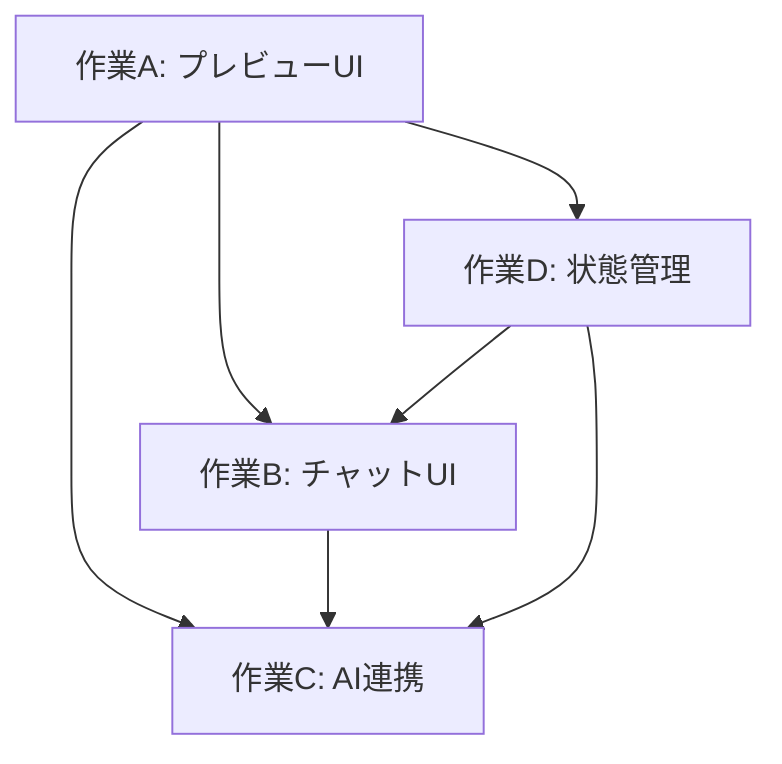

# Content Projection Layer - 並列作業計画

**作成日**: 2025-01-30
**対象**: 全作業担当者

## 概要

実装を4つの独立した作業単位に分割し、同じMacの同じプロジェクトフォルダで4つのターミナルウィンドウを開いて並列作業を行うための計画です。

```
~/Desktop/ContentProjectionLayer/
```

---

## 作業単位の分割

### 📁 作業A: プレビューUI

**担当**: 端末1
**担当ファイル**: `src/components/content-projection-layer/`, `src/lib/content-projection/`, `src/hooks/use-preview-mode.ts`

#### スコープ
- プレビューモードの検出と切り替え
- 編集可能要素のラッパー
- ホバー/クリックによる選択機能
- ハイライト表示

#### 実装タスク

**タスク1: a11y属性生成ユーティリティ**
- ファイル: `src/lib/content-projection/attributes.ts`
- a11y準拠の属性を生成する関数を実装

**タスク2: プレビュープロバイダー**
- ファイル: `src/components/content-projection-layer/preview-provider.tsx`
- URLパラメータ `?mode=preview` を監視
- プレビューモードの状態を提供

**タスク3: 編集可能ラッパー**
- ファイル: `src/components/content-projection-layer/editable-wrapper.tsx`
- a11y属性を付与
- ダブルクリックで直接編集モード
- ホバーでハイライト、クリックで選択

**タスク4: ホバー/クリック機能**
- ファイル: `src/components/content-projection-layer/hover-highlight.tsx`
- ホバー時に要素をハイライト（色変更）
- クリック時に選択状態を切り替え

#### a11y属性の構造
```tsx
<div
  data-cpl-id="blk_abc123"
  data-cpl-type="heading"
  data-cpl-editable="true"
  role="heading"
  aria-level="2"
  aria-label="ヒーローセクションのメイン見出し"
>
  <h2>Creative Developer</h2>
</div>
```

#### 完了条件
- [ ] `attributes.ts` が実装され、a11y属性を生成できる
- [ ] `editable-wrapper.tsx` が実装され、要素をラップできる
- [ ] `hover-highlight.tsx` が実装され、ホバー/クリックが動作する
- [ ] `preview-provider.tsx` が実装され、プレビューモードを制御できる
- [ ] すべてのテストがパスする

---

### 📁 作業B: チャットUI

**担当**: 端末2
**担当ファイル**: `src/components/chat/`, `src/stores/chat-store.ts`

#### スコープ
- サイドバーチャットインターフェース
- メッセージ表示エリア（ユーザー・AI）
- 入力フォーム
- 選択要素の情報表示カード
- ローディング表示

#### 実装タスク

**タスク1: サイドバーメイン**
- ファイル: `src/components/chat/chat-sidebar.tsx`
- 固定位置またはスライド式サイドバー
- 半透明の背景、開閉ボタン
- プレビューモード時のみ表示

**タスク2: メッセージ一覧表示**
- ファイル: `src/components/chat/message-list.tsx`
- ユーザーメッセージとAIメッセージの表示

**タスク3: 入力フォーム**
- ファイル: `src/components/chat/message-input.tsx`
- テキストエリア、送信ボタン
- エンターキーで送信（Shift+Enterで改行）

**タスク4: 選択要素の情報表示**
- ファイル: `src/components/chat/element-info-card.tsx`
- 要素の型、現在のコンテンツ、ラベル/説明を表示

**タスク5: ローディング表示**
- ファイル: `src/components/chat/loading-indicator.tsx`
- AI応答中のアニメーション

#### UIデザインの仕様

| 役割 | 背景色 | 配置 |
|------|--------|------|
| ユーザー | アクセント色（`bg-accent`） | 右寄せ |
| AI | グレー（`bg-gray-100`） | 左寄せ |

#### 完了条件
- [ ] `chat-sidebar.tsx` が実装され、サイドバーが表示される
- [ ] `element-info-card.tsx` が実装され、選択要素が表示される
- [ ] `message-input.tsx` が実装され、メッセージを送信できる
- [ ] `message-list.tsx` が実装され、メッセージが表示される
- [ ] すべてのテストがパスする

---

### 📁 作業C: AI連携

**担当**: 端末3
**担当ファイル**: `src/lib/ai/`, `src/app/api/ai/`

#### スコープ
- AIプロバイダーの抽象化レイヤー
- APIルート実装
- 各プロバイダーの実装（OpenAI/Anthropic/Google）
- エラーハンドリング

#### 実装タスク

**タスク1: プロバイダー基底クラス**
- ファイル: `src/lib/ai/base-provider.ts`
- `AIProvider` インターフェースの定義

**タスク2: OpenAIプロバイダー**
- ファイル: `src/lib/ai/providers/openai.ts`
- OpenAI APIを呼び出す実装

**タスク3: Anthropicプロバイダー**
- ファイル: `src/lib/ai/providers/anthropic.ts`
- Anthropic APIを呼び出す実装

**タスク4: Googleプロバイダー**
- ファイル: `src/lib/ai/providers/google.ts`
- Google APIを呼び出す実装

**タスク5: APIルート**
- ファイル: `src/app/api/ai/edit/route.ts`
- 編集APIエンドポイントの実装

#### セキュリティ規約
- APIキーは環境変数から取得（ハードコード禁止）
- すべてのユーザー入力をバリデーション
- ログに出力しない（APIキー、機密情報）

#### 環境変数
```env
NEXT_PUBLIC_OPENAI_API_KEY=sk-...
NEXT_PUBLIC_ANTHROPIC_API_KEY=sk-ant-...
NEXT_PUBLIC_GOOGLE_API_KEY=...
```

#### 完了条件
- [ ] `base-provider.ts` が実装され、プロバイダーインターフェースが定義される
- [ ] 3つのプロバイダー（OpenAI/Anthropic/Google）が実装される
- [ ] `edit/route.ts` が実装され、APIが動作する
- [ ] すべてのテストがパスする

---

### 📁 作業D: 状態管理

**担当**: 端末4
**担当ファイル**: `src/stores/`（ただし `chat-store.ts` は除く）, `src/lib/storage/`, `src/hooks/use-selected-element.ts`, `src/hooks/use-auto-save.ts`

#### スコープ
- 編集状態の管理（Zustand）
- 選択要素の状態
- 自動保存機能（IndexedDB）
- Undo/Redo

#### 実装タスク

**タスク1: プレビューストア**
- ファイル: `src/stores/preview-store.ts`
- プレビューモード、選択中の要素、編集内容を管理

**タスク2: 編集履歴ストア**
- ファイル: `src/stores/edit-history-store.ts`
- 過去・未来の操作履歴を管理し、Undo/Redoを提供

**タスク3: IndexedDBラッパー**
- ファイル: `src/lib/storage/indexed-db.ts`
- ブラウザのIndexedDBを扱うライブラリ

**タスク4: 自動保存ロジック**
- ファイル: `src/lib/storage/auto-save.ts`
- 編集内容が変更されたら自動保存

#### 不変性の維持（最重要）
```typescript
// 良い例: 不変性の維持
const newEdits = new Map(edits)
newEdits.set(elementId, newContent)

// 悪い例: 直接変更
edits.set(elementId, newContent)
```

#### 自動保存のタイミング
| 操作 | タイミング |
|------|----------|
| AI編集完了 | 即座に保存 |
| 直接編集（テキスト） | フォーカス離脱時（blur） |
| 直接編集（画像） | 置き換え完了時 |

#### Undo/Redoの仕様
- 履歴の最大保持数: 50件
- 履歴が満になると古い履歴から削除

#### 完了条件
- [ ] `preview-store.ts` が実装され、状態管理ができる
- [ ] `edit-history-store.ts` が実装され、Undo/Redoができる
- [ ] `indexed-db.ts` が実装され、永続化ができる
- [ ] `auto-save.ts` が実装され、自動保存が動作する
- [ ] すべてのテストがパスする

---

## 実装の順序と依存関係



### 推奨される並列実行パターン

1. **フェーズ1**: 作業Aを先行して完了させる（型定義・基本構造）
2. **フェーズ2**: 作業B・C・Dを並列で開始
3. **フェーズ3**: 全作業の統合と調整

---

## Gitワークフロー（統合ブランチ方式）

### 前提

**同じMacの同じプロジェクトフォルダ**で、4つのClaude Codeを立ち上げて並列作業します。

この場合、別々のブランチを同時に使用することはできません（git checkout は全ターミナルで同じブランチに切り替わるため）。

### ブランチ戦略：統合ブランチ方式

全てのターミナルで**統合ブランチ（feature/integration）**を使用し、ファイル単位で担当を分けます。

### 作業開始時の手順

**重要**: 同じMacの同じプロジェクトフォルダでは、`.git` は1つしかありません。したがって、**1つのターミナルでブランチを切り替えると、全てのターミナルで同じブランチが有効になります**。

```bash
# 1回だけ実行すればOK（どれか1つのターミナルで実行）
git checkout main
git pull origin main
git checkout feature/integration
# または初めての場合: git checkout -b feature/integration
```

**各ターミナルで行うこと**:
1. Claude Code を起動
2. ユーザーから「あなたは作業X担当です」と明示的に指示を受ける

**Git操作は1回で十分です。各ターミナルで git コマンドを実行する必要はありません。**

### 各作業の担当ファイル

| 作業 | 担当ファイル |
|------|-------------|
| A | `src/components/content-projection-layer/`, `src/lib/content-projection/`, `src/hooks/use-preview-mode.ts` |
| B | `src/components/chat/`, `src/stores/chat-store.ts` |
| C | `src/lib/ai/`, `src/app/api/ai/` |
| D | `src/stores/`（ただし `chat-store.ts` は除く）, `src/lib/storage/`, `src/hooks/use-selected-element.ts`, `src/hooks/use-auto-save.ts` |

### 作業中の注意点

1. **ファイル単位での担当分け**: 同じファイルを複数のターミナルで編集しない
2. **コミット前の確認**: `git status` で変更内容を確認してからコミット
3. **コミットメッセージ**: 担当作業を明記（例: `feat(chat-ui): サイドバーコンポーネント実装`）

### 作業完了時のプッシュ

**どのターミナルでも実行可能です**（ブランチは全ターミナルで共通のため）：

```bash
# 変更を確認
git status

# 変更をステージ（担当ファイルのみ）
git add src/components/chat/

# コミット（担当を明記）
git commit -m "feat(chat-ui): サイドバーコンポーネント実装"

# プッシュ（初回のみ -u フラグが必要）
git push -u origin feature/integration
# 2回目以降: git push
```

---

## ファイル編集権限

### 編集可能なファイル

| 担当者 | 編集可能なファイル | 編集不可 |
|------|------------------|----------|
| **全員** | `work-{id}/progress.md` | 他の作業のファイル |
| **全員** | `work-{id}/CLAUDE.md` | 他の作業のファイル |
| **マネージャー** | `docs/progress-report.md` | 全員 |

### 各作業の担当ファイル

| 作業 | 担当ファイル |
|------|-------------|
| A | `src/components/content-projection-layer/`, `src/lib/content-projection/`, `src/hooks/use-preview-mode.ts` |
| B | `src/components/chat/`, `src/stores/chat-store.ts` |
| C | `src/lib/ai/`, `src/app/api/ai/` |
| D | `src/stores/`（ただし `chat-store.ts` は除く）, `src/lib/storage/`, `src/hooks/use-selected-element.ts`, `src/hooks/use-auto-save.ts` |

### 絶対に編集してはいけないファイル

- 他の作業の `work-{id}/` ディレクトリ
- 他の作業の実装ファイル（`src/` 以下）
- `docs/progress-report.md`（マネージャー以外）

### 進捗報告の更新ルール

```bash
# 各作業担当者は自分の progress.md のみ更新する
work-{id}/progress.md

# マネージャーが全体進捗を確認して、以下を更新
docs/progress-report.md
```

### よくある質問

**Q1: 他の作業の実装内容を知りたい場合**

A: このファイル（`docs/parallel-work-plan.md`）を参照してください。各作業の計画、スコープ、依存関係が記載されています。詳細は `work-{id}/CLAUDE.md` を確認してください。

**Q2: 共通の型定義を変更する必要がある場合**

A: マネージャーに相談してください。作業Aの型定義は他の全ての作業に影響します。

**Q3: 進捗報告を更新するタイミング**

A: 以下のタイミングで更新してください
- タスク完了時
- 1日以上の作業を行った時
- ブロッカーが発生した時

---

## 並列作業固有のディレクトリ構成

各作業単位で独自のディレクトリを作成する場合、以下の構成に従ってください：

### 必須ファイル

```
work-{作業ID}/           # 例: work-a, work-b
├── CLAUDE.md            # 作業固有のルール・設定（スキルから自動参照）
└── progress.md          # 進捗報告書
```

### CLAUDE.md の内容

各作業固有の `work-{id}/CLAUDE.md` には以下を記載してください：
- 作業の範囲と目的
- 使用する型・インターフェース
- 依存する他の作業
- 作業固有のルールや注意点

### 進捗報告書（progress.md）

作業が一段落ついたタイミングで以下を記載してください：
- 完了したタスク一覧
- 作成中のファイル一覧
- 残タスクと予定
- 発生した問題と解決策
- 次のステップ

---

## 進捗管理

### マネージャーの役割

**作業A（プレビューUI）の担当者がマネージャーを兼務**します。

#### マネージャーの責務
1. 全体進捗の管理と共有
2. 各作業の進捗を `docs/progress-report.md` に集約
3. ブロッカーの検出と調整
4. 次のアクションの指示

#### 進捗管理ファイル
- **全体進捗**: `docs/progress-report.md` - マネージャーが更新
- **各作業進捗**: `work-{id}/progress.md` - 各担当者が更新

### 進捗管理テーブル

| 作業 | 担当 | 進捗 | ステータス | ブロッカー |
|------|------|------|----------|----------|
| A: プレビューUI | 端末1 | 100% | ✅ 完了 | なし |
| B: チャットUI | 端末2 | 100% | ✅ 完了 | なし |
| C: AI連携 | 端末3 | 100% | ✅ 完了 | なし |
| D: 状態管理 | 端末4 | 100% | ✅ 完了 | なし |

**全体進捗**: 100% (4作業全て完了) - 統合フェーズへ移行可

詳細な進捗は [`docs/progress-report.md`](progress-report.md) を参照してください。
