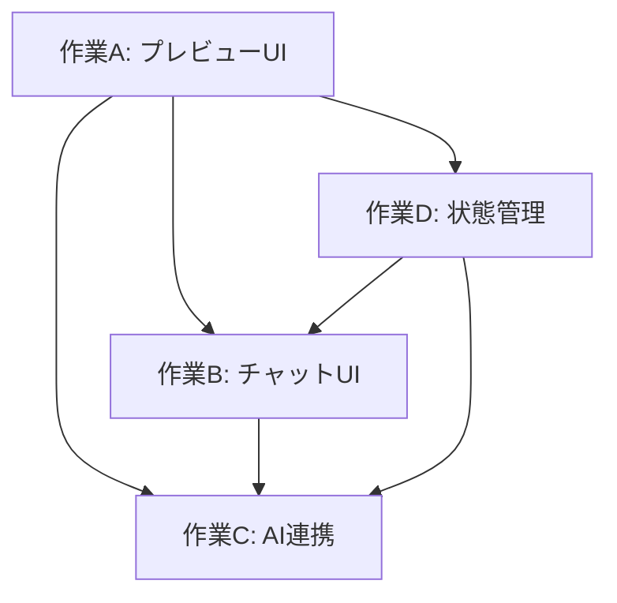

# Content Projection Layer - 並列作業計画

## 概要

実装を4つの独立した作業単位に分割し、複数の端末で並列作業を行うための計画です。

---

## 作業単位の分割

### 📁 作業A: フロントエンド（プレビューUI）

**担当**: 端末1
**ファイル**: `docs/plan-a-preview-ui.md`

#### スコープ
- プレビューモードの検出と切り替え
- 編集可能要素のラッパー
- ホバー/クリックによる選択機能
- ハイライト表示

#### 作成するファイル
```
src/
├── hooks/
│   └── use-preview-mode.ts          ✅ (完了)
├── lib/content-projection/
│   ├── types.ts                      ✅ (完了)
│   ├── generate-id.ts                ✅ (完了)
│   └── attributes.ts                 (未実装)
└── components/content-projection-layer/
    ├── preview-provider.tsx          (未実装)
    ├── editable-wrapper.tsx          (未実装)
    └── hover-highlight.tsx           (未実装)
```

#### 依存関係
- 他の作業単位に依存しない
- 独立して完了可能

---

### 📁 作業B: フロントエンド（チャットUI）

**担当**: 端末2
**ファイル**: `docs/plan-b-chat-ui.md`

#### スコープ
- サイドバーチャットインターフェース
- メッセージ表示エリア
- 入力フォーム
- 選択要素の情報表示

#### 作成するファイル
```
src/
└── components/chat/
    ├── chat-sidebar.tsx              (未実装)
    ├── message-list.tsx              (未実装)
    ├── message-input.tsx             (未実装)
    ├── element-info-card.tsx         (未実装)
    └── loading-indicator.tsx         (未実装)
```

#### 依存関係
- 作業Aの「選択要素のデータ構造」に依存
- `A11yElementInfo` 型を参照

---

### 📁 作業C: バックエンド（AI連携）

**担当**: 端末3
**ファイル**: `docs/plan-c-ai-backend.md`

#### スコープ
- AIプロバイダーの抽象化
- APIルート実装
- 各プロバイダーの実装（OpenAI/Anthropic/Google）

#### 作成するファイル
```
src/
├── lib/ai/
│   ├── base-provider.ts              (未実装)
│   ├── providers/
│   │   ├── openai.ts                 (未実装)
│   │   ├── anthropic.ts              (未実装)
│   │   └── google.ts                 (未実装)
│   └── index.ts                      (未実装)
└── app/api/ai/
    └── edit/route.ts                 (未実装)
```

#### 依存関係
- 作業Aの`A11yElementInfo`型を参照
- 作業Dの状態管理と連携

---

### 📁 作業D: 状態管理

**担当**: 端末4
**ファイル**: `docs/plan-d-state-management.md`

#### スコープ
- 編集状態の管理（Zustand）
- 選択要素の状態
- 自動保存機能
- Undo/Redo

#### 作成するファイル
```
src/
├── stores/
│   ├── preview-store.ts              (未実装)
│   └── edit-history-store.ts         (未実装)
├── lib/storage/
│   ├── indexed-db.ts                 (未実装)
│   └── auto-save.ts                  (未実装)
└── hooks/
    ├── use-selected-element.ts       (未実装)
    └── use-auto-save.ts              (未実装)
```

#### 依存関係
- 作業Aの型定義を参照
- すべての作業単位から利用される

---

## 実装の順序と依存関係



### 推奨される並列実行パターン

1. **フェーズ1**: 作業Aを先行して完了させる（型定義・基本構造）
2. **フェーズ2**: 作業B・C・Dを並列で開始
3. **フェーズ3**: 全作業の統合と調整

---

## 各作業ファイルの詳細

以下のファイルに個別の作業計画を記載します：

1. `docs/plan-a-preview-ui.md` - プレビューUI実装
2. `docs/plan-b-chat-ui.md` - チャットUI実装
3. `docs/plan-c-ai-backend.md` - AIバックエンド実装
4. `docs/plan-d-state-management.md` - 状態管理実装

---

## 共有リソース

### 共通の型定義
- `src/lib/content-projection/types.ts` - 全作業で共有

### 共通のユーティリティ
- `src/lib/content-projection/generate-id.ts` - ID生成

### 環境変数
```env
# .env.local.example
NEXT_PUBLIC_OPENAI_API_KEY=sk-...
NEXT_PUBLIC_ANTHROPIC_API_KEY=sk-ant-...
NEXT_PUBLIC_GOOGLE_API_KEY=...
```

---

## 並列実行時の注意点

1. **型定義の変更**: 作業Aでの型変更は、他の作業に影響するため事前に調整
2. **Gitコンフリクト**: 異なる作業単位は異なるファイルを扱うため、コンフリクトは最小限
3. **定期的な同期**: 30分〜1時間ごとに進捗を共有

---

## 並列作業固有のディレクトリ構成

各作業単位で独自のディレクトリを作成する場合、以下の構成に従ってください：

### 必須ファイル

```
work-{作業ID}/           # 例: work-a, work-b
├── CLAUDE.md            # 作業固有のルール・設定
└── progress.md          # 進捗報告書（英単語で適切な名前）
```

### CLAUDE.md の内容
各作業固有の `CLAUDE.md` には以下を記載してください：
- 作業の範囲と目的
- 使用する型・インターフェース
- 依存する他の作業
- 作業固有のルールや注意点

### 進捗報告書（progress.md）
作業が一段落ついたタイミングで以下を記載してください：
- 完了したタスク一覧
- 作成中のファイル一覧
- 残タスクと予定
- 発生した問題と解決策
- 次のステップ

### 進捗報告書のテンプレート

```markdown
# Progress Report - {作業ID}

## Summary
{作業の簡単な要約}

## Completed Tasks
- [x] {完了したタスク1}
- [x] {完了したタスク2}

## In Progress
- [ ] {進行中のタスク1}
- [ ] {進行中のタスク2}

## Files Created
- `path/to/file1.ts` - {説明}
- `path/to/file2.tsx` - {説明}

## Issues & Solutions
### Issue: {問題のタイトル}
**Description**: {問題の説明}
**Solution**: {解決策}

## Next Steps
1. {次のステップ1}
2. {次のステップ2}

## Notes
{追加のメモ}
```

---

## 次のステップ

1. 各作業ファイル（`plan-a-preview-ui.md` 等）を作成
2. 各作業単位の詳細なタスクを定義
3. 並列実行を開始

---

## 進捗管理

| 作業 | 担当 | ステータス | 備考 |
|------|------|----------|------|
| A: プレビューUI | - | 🟡 進行中 | 型定義完了 |
| B: チャットUI | - | ⚪ 未着手 | Aに依存 |
| C: AI連携 | - | ⚪ 未着手 | A・Dに依存 |
| D: 状態管理 | - | ⚪ 未着手 | Aに依存 |
